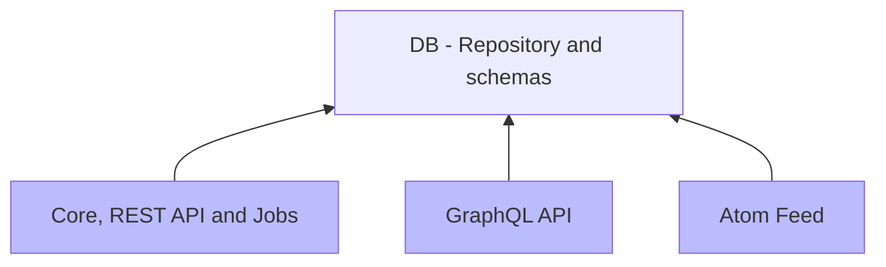
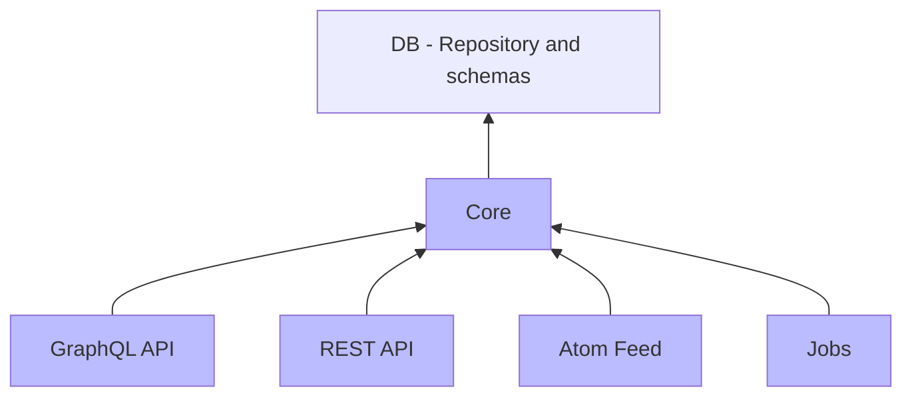

# CaptainFact API

Staging-[](https://gitlab.com/CaptainFact/captain-fact-api/commits/staging)
&nbsp;&nbsp;
Master-[](https://gitlab.com/CaptainFact/captain-fact-api/commits/master)

## Install & Run

  * Download project's dependencies with `./dev/get_dependecies.sh`
  * Create / launch a postrges instance on your local machine. If you have
  docker installed, you can use the pre-seed postgres docker image:
  `docker run -d --name postgres_dev -p 5432:5432 captainfact/dev-db:latest`
  * Migrate your database with `./dev/db_migrate.sh`
  * Start server with `./dev/start_server.sh`

Following services will be started:

  * [localhost:4000](http://localhost:4000) - REST API
  * [localhost:4001](https://localhost:4001) - REST API (https)
  * [localhost:4002](http://localhost:4002) - GraphQL API
  * [localhost:4003](https://localhost:4003) - GraphQL API (https)
  * [localhost:4004](http://localhost:4004) - Atom feed

You can run tests with `./dev/test.sh`. You can filter which tests to run by
running something like `./dev/test.sh test/your_test_subpath`.
Check `./dev/test.sh` script comments for details.

A concurrency bug sometimes trigger when running tests. If you get something 
like the following just re-run your tests:

```
04:16:05.680 [error] GenServer CaptainFactJobs.Reputation terminating
** (stop) exited in: GenServer.call(#PID<0.1308.0>, {:checkout, #Reference<0.2515546025.2910322690.13424>, true, 15000}, 5000)
    ** (EXIT) shutdown: "owner #PID<0.1307.0> exited with: shutdown"
    (db_connection) lib/db_connection/ownership/proxy.ex:32: DBConnection.Ownership.Proxy.checkout/2
    (db_connection) lib/db_connection.ex:928: DBConnection.checkout/2
...
** (exit) exited in: GenServer.call(CaptainFactJobs.Reputation, :update_reputations, 120000)
** (EXIT) exited in: GenServer.call(#PID<0.1308.0>, {:checkout, #Reference<0.2515546025.2910322690.13424>, true, 15000}, 5000)
** (EXIT) shutdown: "owner #PID<0.1307.0> exited with: shutdown"
```

## Project architecture

Elixir offers very nice ways to separate concerns and work with microservices.
This application is organized as an [umbrella project](https://elixir-lang.org/getting-started/mix-otp/dependencies-and-umbrella-apps.html)
which allows us to divide CaptainFact API into small apps.

* Current architecture (blue = deployed releases, others = libraries)



* Future architecture (blue = deployed releases, others = libraries)



### File structure


```
.
├── apps
│   ├── captain_fact => A monolith containing REST API, jobs and core functions
│   │   ├── lib
│   │   │   ├── captain_fact => Core functions + jobs
│   │   │   └── captain_fact_web => REST API
│   │   └── priv/secrets => dev secrets for this app
│   ├── captain_fact_graphql => GraphQL API
│   │   └── priv/secrets => dev secrets for this app
│   ├── captain_fact_atom_feed => Atom feed
│   └── db => DB repository and schemas
│       ├── lib
│       │   ├── db
│       │   ├── db_schema => Contains all the schemas (Video, Speaker, Comment...etc)
│       │   ├── db_type => Special types (SpeakerPicture...etc)
│       │   └── db_utils => Some utils functions
│       └── priv
│           ├── repo/migrations => All DB migrations files
│           └── secrets => dev secrets for DB (db username, password...etc)
├── README.md => You're reading it right now. Are you ?
├── rel => Release configs & tools
│   ├── commands => Commands that will be available to run on the release (seed DB...etc)
│   ├── config.exs => Releases configuration
│   └── docker => Docker-specific files & configs
```

## Styling

Code should follow [Elixy Style Guide](https://github.com/christopheradams/elixir_style_guide)
and [Credo style guide](https://github.com/rrrene/elixir-style-guide)
as much as possible.

Avoid lines longer than 80 characters, **never** go beyond 110 characters.

## Known problems and limitations

* Error messages are not centralized