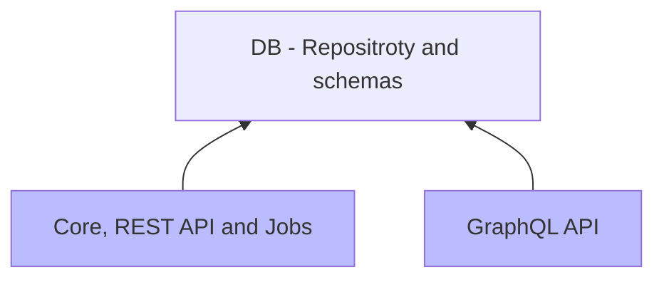
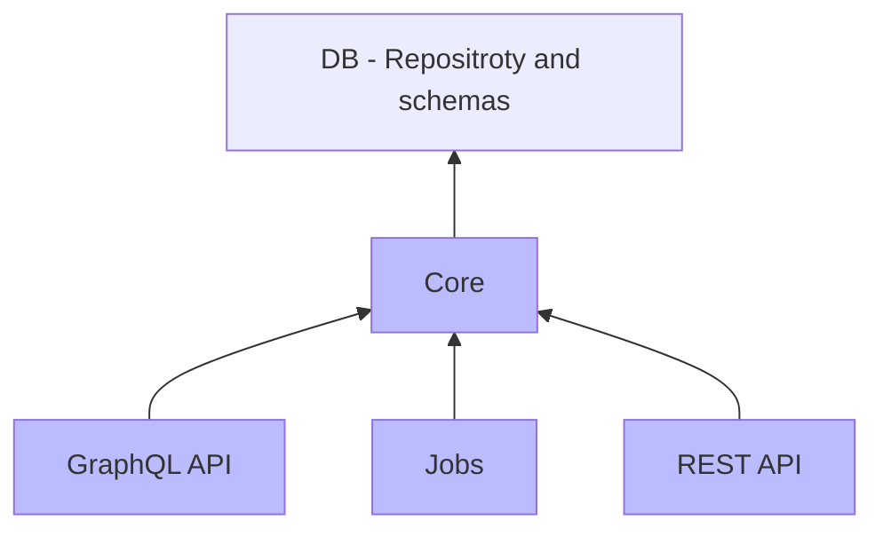

# CaptainFact API

Staging-[](https://gitlab.com/CaptainFact/captain-fact-api/commits/staging)
&nbsp;&nbsp;
Master-[](https://gitlab.com/CaptainFact/captain-fact-api/commits/master)

## Project architecture

Elixir offers very nice ways to separate concerns and work with microservices.
This application is organized as an [umbrella project](https://elixir-lang.org/getting-started/mix-otp/dependencies-and-umbrella-apps.html)
which allows us to divide CaptainFact API into small apps.

* Current architecture (blue = deployed releases, others = libraries)



* Future architecture (blue = deployed releases, others = libraries)



### File structure


```
.
├── apps
│   ├── captain_fact => Currently, a monolith containing REST API, jobs and core functions
│   │   ├── lib
│   │   │   ├── captain_fact => Core functions + jobs
│   │   │   ├── captain_fact_web => REST API
│   ├── captain_fact_graphql => GraphQL API
│   └── db => DB repository and schemas
│       ├── lib
│       │   ├── db
│       │   ├── db_schema => Contains all the schemas (Video, Speaker, Comment...etc)
│       │   ├── db_type => Special types (SpeakerPicture...etc)
│       │   └── db_utils => Some utils functions
│       ├── priv
│       │   ├── repo
│       │   │   ├── migrations => Contains all the migrations
├── priv
│   └── secrets => All your dirty little secrets, loaded at runtime
├── README.md => You're reading it right now. Are you ?
├── rel => Release configs & tools
│   ├── commands => Commands that will be available to run on the release (seed DB...etc)
│   ├── config.exs => Releases configuration
│   ├── docker => Docker-specific files & configs
```

## Install

  * Install dependencies with `mix deps.get`
  * Create and migrate your database with `mix ecto.setup`
  * Run tests with `mix test` (may generate some warnings, only check final results)


# WARNING: Recently refactored. Documentation below may not be up-to-date !
  
## Configure

### Dev

Most secrets are already set to defaults in dev (see `config/dev.exs`). However, setting secrets is useful when you need
to work with APIs (S3, mailgun, youtube...).

You can add them either using env or by supplying files in `priv/secrets` 

[!] If you don't specify a `youtube_api_key` secret, videos metadata will be fetched from OpenGraph metadata, which
is unable to extract video's language.

### Prod

Following environment variables are required to run in prod. They may be supplied
using environment variables or by using secret files (as generated by docker swarm / kubernettes)
in `/run/secrets`. If a file is supplied, its name must be lowercase and must not contains the `CF_` prefix.

* CF_HOST
* CF_PORT
* CF_PORT_SSL
* CF_SECRET_KEY_BASE
* CF_DB_HOSTNAME
* CF_DB_USERNAME
* CF_DB_PASSWORD
* CF_DB_NAME
* CF_FACEBOOK_APP_ID
* CF_FACEBOOK_APP_SECRET
* CF_FRONTEND_URL
* CF_CHROME_EXTENSION_ID

Following files must also exist in `/run/secrets`; the best way is to use docker secrets but it would work if we mount
a regular directory containing the file:
* fullchain.pem
* privkey.pem
  
## Run

Start postgres first, then start Phoenix endpoint with `mix phx.server`

API is started on [`localhost:4000`](http://localhost:4000) for http and
[`localhost:4001`](http://localhost:4001) for https.


## Learn more

  * Official website: http://www.phoenixframework.org/
  * Guides: http://phoenixframework.org/docs/overview
  * Docs: https://hexdocs.pm/phoenix
  * Source: https://github.com/phoenixframework/phoenix
