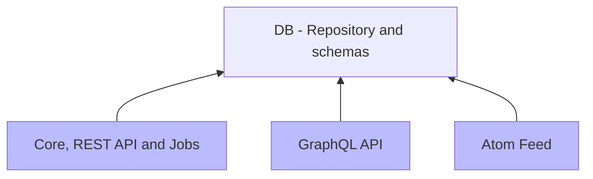
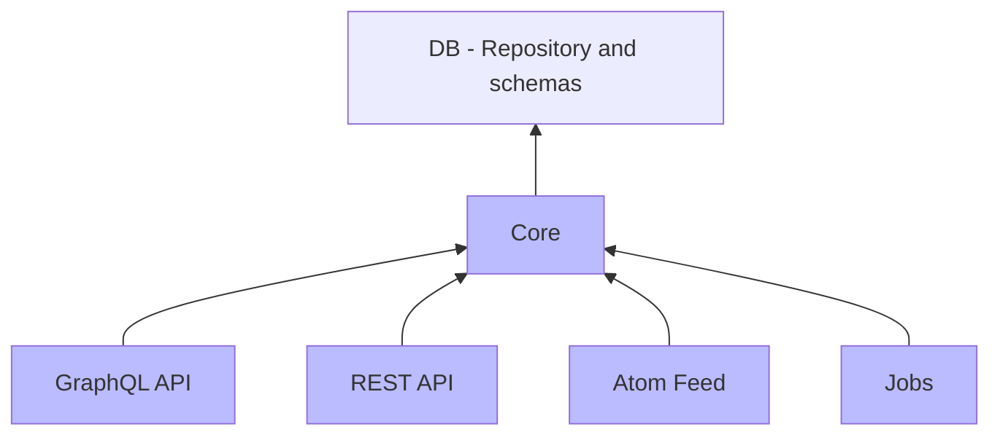

# CaptainFact API

Staging-[](https://gitlab.com/CaptainFact/captain-fact-api/commits/staging)
&nbsp;&nbsp;
Master-[](https://gitlab.com/CaptainFact/captain-fact-api/commits/master)

## Install & Run

  * [Install Elixir](https://elixir-lang.org/install.html)
  * Install Phoenix (web framework): `mix local.hex && mix archive.install https://github.com/phoenixframework/archives/raw/master/phx_new.ez`
  * Download project's dependencies with `mix deps.get`
  * Create / launch a postrges instance on your local machine. If you have docker installed,
    you can achieve this by simply running:
  `docker run -d --name postgres_dev -p 5432:5432 -e POSTGRES_PASSWORD=postgres -e POSTGRES_DB=captain_fact_dev postgres:9.6`
  * Create and migrate your database with `mix ecto.setup`
  * Start server with `mix phx.server` or with `iex -S mix phx.server` if you need access to an Elixir console

Following services will be started:

  * [localhost:4000](http://localhost:4000) - REST API
  * [localhost:4001](https://localhost:4001) - REST API (https)
  * [localhost:4002](http://localhost:4002) - GraphQL API
  * [localhost:4003](https://localhost:4003) - GraphQL API (https)
  * [localhost:4004](http://localhost:4004) - Atom feed

To run tests simply execute `mix test`

## Project architecture

Elixir offers very nice ways to separate concerns and work with microservices.
This application is organized as an [umbrella project](https://elixir-lang.org/getting-started/mix-otp/dependencies-and-umbrella-apps.html)
which allows us to divide CaptainFact API into small apps.

* Current architecture (blue = deployed releases, others = libraries)



* Future architecture (blue = deployed releases, others = libraries)



### File structure


```
.
├── apps
│   ├── captain_fact => A monolith containing REST API, jobs and core functions
│   │   ├── lib
│   │   │   ├── captain_fact => Core functions + jobs
│   │   │   └── captain_fact_web => REST API
│   │   └── priv/secrets => dev secrets for this app
│   ├── captain_fact_graphql => GraphQL API
│   │   └── priv/secrets => dev secrets for this app
│   ├── captain_fact_atom_feed => Atom feed
│   └── db => DB repository and schemas
│       ├── lib
│       │   ├── db
│       │   ├── db_schema => Contains all the schemas (Video, Speaker, Comment...etc)
│       │   ├── db_type => Special types (SpeakerPicture...etc)
│       │   └── db_utils => Some utils functions
│       └── priv
│           ├── repo/migrations => All DB migrations files
│           └── secrets => dev secrets for DB (db username, password...etc)
├── README.md => You're reading it right now. Are you ?
├── rel => Release configs & tools
│   ├── commands => Commands that will be available to run on the release (seed DB...etc)
│   ├── config.exs => Releases configuration
│   └── docker => Docker-specific files & configs
```

## Known problems and limitations

* Error messages are not centralized